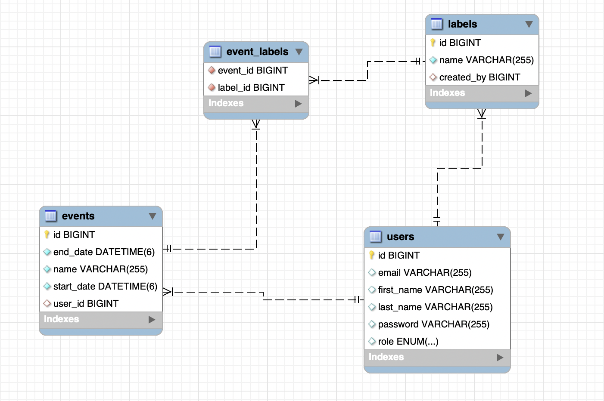

# Events Calendar Backend

A REST API created with Spring boot. It allows creating events with labels. Includes JWT authentication. Backend for [Events Calendar](https://github.com/martynakr/events-calendar/)

## ERD



## Running instructions

1. Clone the project to your computer

```bash
git clone git@github.com:martynakr/spring-boot-postgres-render-deployment.git
```

2. Set up a `.env` file

-   You can start by copying the example file

```bash
cp .env.example .env
```

-   Now all you need to do is update your secret key value

3. Create a database for the application via MySQL Workbench or the mySQL command line tool on your computer

```SQL
CREATE DATABASE events;
```

4. (Optional) Run the seeder:

```bash
mvn spring-boot:run -Dspring-boot.run.arguments=seed
```

Running the seeder will create two users in your database and some events and labels for those users. You can then use their details to log in to the application with the following payloads:

```json
{
    "email": "john@email.com",
    "password": "pass"
}
```

or

```json
{
    "email": "jane@email.com",
    "password": "pass"
}
```

5. If you don't wish to seed the database, you can just run the application with the following command:

```bash
mvn spring-boot:run
```

## Available Endpoints

-   `POST /auth/register` - allows a new user to create an account, example payload:

```json
{
    "firstName": "Martyna",
    "lastName": "Krol",
    "email": "martyna@email.com",
    "password": "password"
}
```

-   `POST /auth/login` - allows an already existing user to access their resources, example payload:

```json
{
    "email": "martyna@email.com",
    "password": "password"
}
```

-   `GET /events` - returns all events created by the logged-in user, example response

```json
[
    {
        "id": 2,
        "name": "10km run",
        "startDate": "2024-06-17T10:30:00",
        "endDate": "2024-06-17T12:30:00",
        "labels": [
            {
                "id": 1,
                "name": "work"
            },
            {
                "id": 2,
                "name": "sport"
            },
            {
                "id": 3,
                "name": "family time"
            }
        ]
    }
]
```

-   `POST /events`
-   `PATCH /events/{id}`
-   `GET /labels`

## Tests

Coming soon

## Change log

-   **2023** - set up a REST API that allows creating events and labels for events. Added authentication and set up One-To-Many relationship between User and Event. Each user can only get events that belong to them.

-   **12 June 2024** - Adding a relationship between Label and User - each user will now be able to create their own labels and won't be able to view labels that belong to other users.

-   **14 June 2024** - Updating authentication - JWT is now sent as a cookie

-   **16 June 2024** - Updating the logic for creating a label - check if a label with such name exists for the logged-in user, only if it doesn't - create it. Added a colour property to the label entity - so a consistent background colour can be displayed on the frontend. Updated the seeder to include the colour property.

-   **18 June 20204** - Implemented logout endpoint

-   **19 June 2024** - Solved the issue of every error resulting in 401 by adding

```java
				.dispatcherTypeMatchers(DispatcherType.ERROR).permitAll()
```

to SecurityConfig class

-   **! July 2024** - added controller tests for `EventController` class. Set up Github Actions workflow to run tests on push to any branch.

[Synchronizer Token Pattern](https://cheatsheetseries.owasp.org/cheatsheets/Cross-Site_Request_Forgery_Prevention_Cheat_Sheet.html#synchronizer-token-pattern)

## Known issues

-   Because the JWT is sent as a cookie, the whole full stack application is vulnerable to CSRF attacks. A potential solution to this could be using the Signed Double-Submit Cookie Pattern
-   All exceptions return a 401 error at this point

## Next steps

-   Add logic to ensure only unique colours for labels get generated
-   Setting up automated tests on push to branches with Github Actions
-   Deploying the backend on Render as per [instructions I created earlier](https://github.com/martynakr/spring-boot-postgres-render-deployment)
-   Setting up continuous deployment
